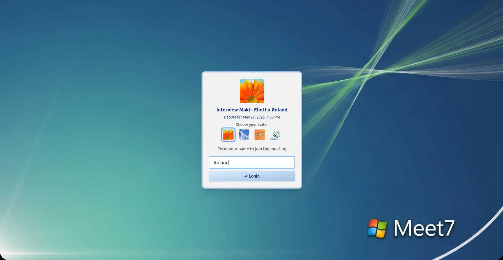

# 🤖 Meet7 - An AI HR Automatic Interview Platform with Windows 7 UI

<p align="center">
  
  
  
</p>

> **Revolutionizing recruitment with AI-powered candidate assessment and nostalgic Windows 7 UI**

An intelligent HR platform that automates the interview process by analyzing candidate resumes against company profiles, generating comprehensive assessments, and providing interactive dashboards for hiring decisions.

## ✨ Features

### 🎯 **Smart Resume Analysis**
- **Automated CV Parsing**: Extract and analyze candidate information from resumes
- **Company Alignment**: Match candidates against company values, culture, and job requirements
- **Intelligent Scoring**: Generate comprehensive scores across multiple dimensions:
  - Technical Skills Assessment (1-5 scale)
  - Experience Level Evaluation
  - Industry Relevance Matching
  - Culture Alignment Analysis
  - Overall Fit Score

### 📊 **Interactive Dashboard**
- **Real-time Analytics**: Track candidate performance and hiring metrics
- **Airtable Integration**: Seamless data synchronization for team collaboration
- **Decision Support**: Priority levels, risk assessment, and hiring recommendations
- **Aggregated Insights**: Company-wide statistics and trends

### 🎨 **Nostalgic Frontend Experience**
- **Windows 7 Inspired UI**: Unique, nostalgic interface built with Next.js
- **Responsive Design**: Modern functionality with retro aesthetics
- **Intuitive Navigation**: Familiar Windows-style interface for enhanced user experience

### 🔧 **Advanced Backend Processing**
- **Python Integration**: Embedded Python interpreter for complex data processing
- **Multi-source Data**: Company values, about pages, and job descriptions analysis
- **JSON API**: RESTful endpoints for seamless frontend-backend communication
- **File-based Storage**: Simple, persistent data storage without database complexity

## API Endpoints

### Core Endpoints

- `POST /analyze-cv` - Analyze a CV against company requirements
- `GET /companies` - Get list of available companies
- `GET /health` - Health check
- `GET /` - API information
- `GET /docs` - Interactive API documentation (Swagger UI)

## Setup Instructions

### 1. Prerequisites

- Python 3.8+
- Mistral AI API key

### 2. Environment Setup

1. **Clone and navigate to the project:**
   ```bash
   cd src/cv_reader
   ```

2. **Install dependencies:**
   ```bash
   pip install -r ../../requirements.txt
   ```

3. **Set up environment variables:**
   Create a `.env` file in the project root with:
   ```
   MISTRAL_MY_API_KEY=your_mistral_api_key_here
   ```

### 3. Run the API Server

```bash
# From src/cv_reader directory
python app.py
```

Or using uvicorn directly:
```bash
uvicorn app:app --host 0.0.0.0 --port 8000 --reload
```

The API will be available at: `http://localhost:8000`

## Testing the API

### Option 1: Interactive Documentation (Recommended)

1. Start the server
2. Open your browser and go to: `http://localhost:8000/docs`
3. Use the Swagger UI to test endpoints interactively

### Option 2: Python Test Script

```bash
# Install requests if not already installed
pip install requests

# Run the test script
python ../../test_api.py
```

### Option 3: cURL Commands

**Health Check:**
```bash
curl -X GET "http://localhost:8000/health"
```

**Get Companies:**
```bash
curl -X GET "http://localhost:8000/companies"
```

**Analyze CV:**
```bash
curl -X POST "http://localhost:8000/analyze-cv" \
  -H "accept: application/json" \
  -H "Content-Type: multipart/form-data" \
  -F "file=@path/to/your/cv.pdf" \
  -F "company_name=mixedbread"
```

### Option 4: Python Requests

```python
import requests

# Test health check
response = requests.get("http://localhost:8000/health")
print(response.json())

# Get companies
response = requests.get("http://localhost:8000/companies")
companies = response.json()["companies"]
print(f"Available companies: {companies}")

# Analyze CV
with open("path/to/cv.pdf", "rb") as pdf_file:
    files = {"file": ("cv.pdf", pdf_file, "application/pdf")}
    data = {"company_name": "mixedbread"}
    response = requests.post("http://localhost:8000/analyze-cv", files=files, data=data)

if response.status_code == 200:
    result = response.json()
    print(f"Fit Score: {result['screening_test']['fit_score']}/5")
    print(f"Recommendation: {result['screening_test']['recommendation']}")
else:
    print(f"Error: {response.text}")
```

## API Response Format

### CV Analysis Response

```json
{
  "candidate_analysis": {
    "basic_info": {
      "candidate_name": "John Doe",
      "analysis_timestamp": "2024-01-15T10:30:00",
      "company_name": "mixedbread",
      "processing_time_seconds": 15.67
    }
  },
  "phase_1_initial_screening": {
    "fit_assessment": {
      "overall_fit_score": 4,
      "recommendation": "Proceed with interview",
      "justification": "Strong technical background with relevant experience",
      "breakdown": {
        "technical_skills": 4,
        "experience_level": 4,
        "industry_relevance": 3,
        "culture_alignment": 4
      }
    },
    "technical_gap_analysis": {
      "hiring_risk": "Low",
      "overall_assessment": "Minor gaps in DevOps tools, strong foundation otherwise",
      "identified_gaps": [
        {
          "category": "Technical Skills",
          "gap": "Limited experience with Kubernetes",
          "severity": "Medium",
          "impact_on_role": "May need initial support for container orchestration",
          "mitigation_strategy": "Provide Kubernetes training in first 3 months"
        }
      ],
      "strengths": [
        "Strong Python and API development experience",
        "Solid database knowledge"
      ]
    },
    "screening_decision": {
      "proceed_to_next_phase": true,
      "priority_level": "High",
      "notes_for_recruiter": "Strong candidate, focus interview on system design"
    }
  },
  "phase_2_hr_behavioral": {
    "company_context": {
      "company_description": "We are a cutting-edge startup...",
      "key_values": ["Innovation", "Teamwork", "Quality"]
    },
    "behavioral_questions": [
      {
        "question": "Tell me about a time you innovated to solve a problem",
        "tests_value": "Innovation",
        "what_to_look_for": "Creative problem-solving, initiative",
        "follow_up_areas": ["Impact measurement", "Team collaboration"]
      }
    ],
    "interview_guidance": {
      "focus_areas": ["Cultural fit", "Communication skills"],
      "red_flags_to_watch": ["Poor communication", "Lack of examples"],
      "estimated_duration": "30-45 minutes"
    }
  },
  "phase_3_technical_interview": {
    "technical_questions": [
      {
        "type": "global",
        "question": "Explain the difference between SQL and NoSQL databases",
        "focus_area": "Database fundamentals",
        "difficulty": "Mid",
        "expected_depth": "Should cover use cases, trade-offs, examples",
        "follow_up_questions": ["When would you choose one over the other?"]
      },
      {
        "type": "specific",
        "question": "How would you optimize a Python API for high throughput?",
        "focus_area": "Python performance optimization",
        "difficulty": "Senior",
        "expected_depth": "Caching, async, database optimization",
        "relates_to_gaps": ["Performance optimization skills"]
      },
      {
        "type": "use_case",
        "question": "Design a system to handle 1M daily active users",
        "focus_area": "System design and scalability",
        "difficulty": "Senior",
        "expected_depth": "Load balancing, database sharding, caching",
        "time_allocation": "20-30 minutes"
      }
    ],
    "interview_guidance": {
      "focus_areas": ["Problem-solving approach", "Technical depth"],
      "gap_specific_probes": ["Ask about Kubernetes experience"],
      "estimated_duration": "60-90 minutes"
    }
  },
  "recruiter_summary": {
    "overall_recommendation": "Strong candidate - Recommend hire with onboarding support",
    "key_strengths": [
      "Excellent technical foundation",
      "Relevant industry experience",
      "Good cultural alignment"
    ],
    "areas_of_concern": [
      "Limited DevOps experience - needs support"
    ],
    "interview_priorities": [
      "Validate system design thinking",
      "Assess learning agility for new technologies"
    ],
    "onboarding_recommendations": [
      "Assign DevOps mentor",
      "Kubernetes training program"
    ],
    "decision_confidence": "High"
  }
}
```

## Project Structure

```
src/cv_reader/
├── app.py              # Main FastAPI application
├── models.py           # Pydantic models for request/response
├── services.py         # Business logic and AI services
├── prompts/
│   └── prompts.py      # AI prompts for different analyses
└── main.py             # Original script (for reference)

data/
├── companies/          # Company data (values, about, offers)
│   └── mixedbread/
└── candidates/         # Sample CV files

requirements.txt        # Python dependencies
test_api.py            # Test script
README.md              # This file
```

## Error Handling

The API includes comprehensive error handling:

- **400 Bad Request**: Invalid file format or unreadable PDF
- **404 Not Found**: Company not found or missing company data
- **422 Unprocessable Entity**: AI response parsing errors
- **500 Internal Server Error**: Server or API errors

## Development Notes

- The API uses temporary files for PDF processing and cleans them up automatically
- All AI responses are parsed and validated as JSON
- CORS is enabled for development (configure for production)
- Processing times are tracked and returned in responses

## Production Considerations

1. **Security**: Configure CORS properly, add authentication
2. **Rate Limiting**: Add rate limiting for API calls
3. **Caching**: Cache company data and AI responses
4. **Monitoring**: Add logging and monitoring
5. **File Storage**: Consider cloud storage for uploaded files
6. **Database**: Add database for storing analysis results

## 🚀 Quick Start

### Prerequisites
- Python 3.6+
- Node.js 16+
- npm or yarn

### Backend Setup
```bash
# Clone the repository
git clone https://github.com/LeandreLeBizec/AI_Hackathon_TechParis.git
cd AI_Hackathon_TechParis

# Navigate to backend
cd back/api

# Install Python dependencies
pip install -r requirements.txt

# Set up environment variables
# Add your API keys (GOOGLE_API_KEY, BEY_AVATAR_ID)

# Run the backend
python upload_cv.py
```

### Frontend Setup
```bash
# Navigate to frontend directory (when available)
cd front

# Install dependencies
pnpm  install

# Start development server
pnpm run dev
```

## 🏗️ Architecture

```
┌─────────────────┐    ┌──────────────────┐    ┌─────────────────┐
│   Next.js UI   │◄──►│   Python API     │◄──►│   Airtable      │
│  (Windows 7)    │    │   (FastAPI)      │    │   Dashboard     │
└─────────────────┘    └──────────────────┘    └─────────────────┘
                              │
                              ▼
                       ┌──────────────────┐
                       │  Data Processing │
                       │  • CV Parser     │
                       │  • Company Data  │
                       │  • AI Analysis   │
                       └──────────────────┘
```

## 📁 Project Structure

```
├── back/
│   └── api/               # Backend API
│       ├── upload_cv.py   # Main application entry point
│       ├── src/
│       │   ├── cv_reader/ # Resume parsing and analysis
│       │   └── git_hub_reader/ # Company data extraction
│       ├── data/
│       │   ├── companies/ # Company profiles and job data
│       │   └── candidate_results/ # Analysis results storage
│       ├── transcripts/   # Interview transcripts
│       └── output/       # Generated reports and analysis
├── front/                # Next.js Windows 7 UI (coming soon)
└── README.md            # This file
```

---

**Built with ❤️ for the future of HR technology**
