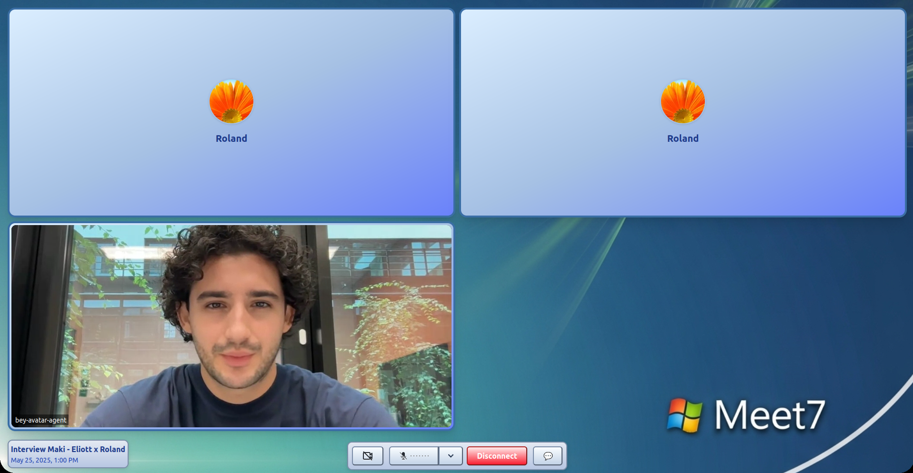
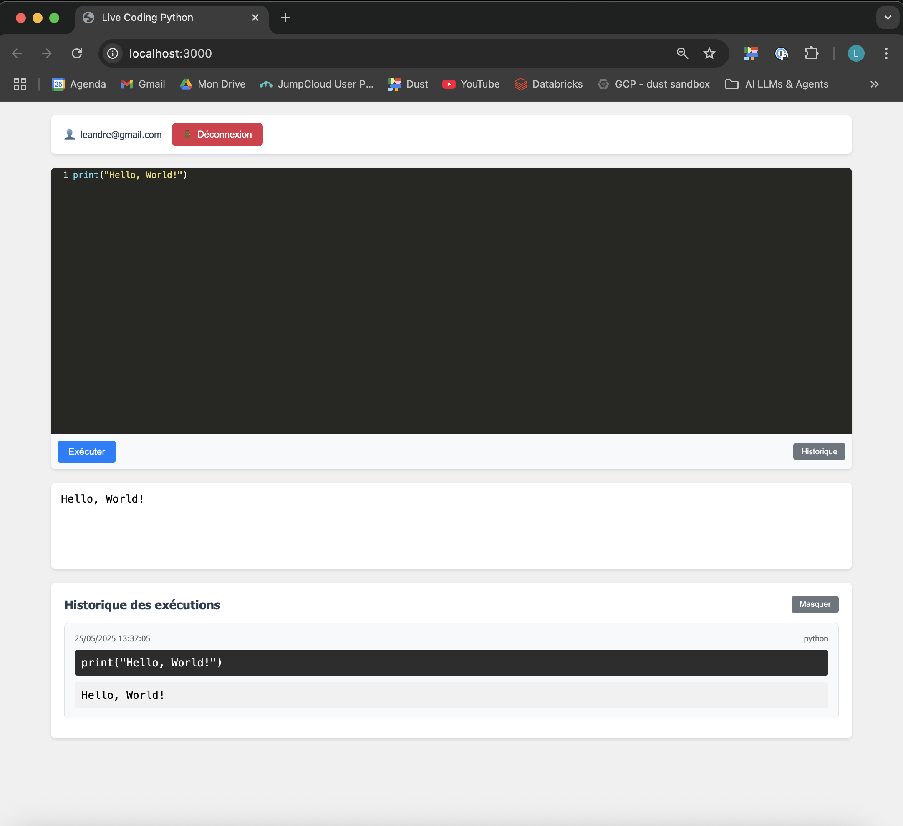

# 🤖 Meet7 - An AI HR Automatic Interview Platform with Windows 7 UI

<p align="center">
  
  
  
</p>

# Revolutionizing recruitment with AI-powered candidate assessment and nostalgic Windows 7 UI

A sophisticated AI-powered HR interview agent that conducts real-time interviews with job candidates using 3D avatar technology, company knowledge integration, and live coding assessment capabilities.
An intelligent HR platform that automates the interview process by analyzing candidate resumes against company profiles, generating comprehensive assessments, and providing interactive dashboards for hiring decisions.

## Project Overview

This project creates an AI agent capable of conducting HR interviews by leveraging:
- Company knowledge (guidelines, values, job descriptions, organization structure)
- Candidate information (CV, motivation letter, LinkedIn, GitHub)
- Real-time video interaction with 3D avatar generation
- Specialized tools that can be triggered during the interview process

## Repository Architecture

```
AI_Hackathon_TechParis/
├── agent-hr/                 # Core HR agent implementation
│   ├── app.py                # Main agent application using LiveKit
│   ├── Airtable_API.py       # Airtable integration for data storage
│   ├── Instructions.txt      # Agent prompt instructions
│   └── get_token.py          # Authentication utilities
│
├── back/api/                 # Backend API services
│   ├── src/
│   │   ├── cv_reader/        # CV parsing and analysis components
│   │   └── git_hub_reader/   # GitHub profile analysis utilities
│   ├── transcripts/          # Storage for interview transcripts
│   ├── test_api.py           # API testing utilities
│   ├── transcript_reader.py  # Transcript processing utilities
│   └── upload_cv.py          # CV upload and processing endpoint
│
├── front/                    # Next.js frontend application
│   ├── app/                  # Application components
│   │   ├── components/       # UI components including MeetRoom
│   │   └── page.tsx          # Main page component
│   └── public/               # Static assets
│
├── live-coding/              # Live coding assessment environment
│   ├── app.js                # Client-side application
│   ├── server.js             # Server for code execution
│   └── index.html            # Live coding interface
│
└── img/                      # Project images and screenshots
```

## Key Components

### 1. HR Agent (agent-hr)

The core AI interviewer built with LiveKit Agents that:
- Processes candidate information from a pre-analysis pipeline
- Conducts structured interviews following a defined flow
- Integrates with Bey for 3D avatar generation
- Uses Google's Gemini model for natural language understanding and generation
- Monitors and responds to live coding exercises
- Stores interview data in Airtable

### 2. Backend API (back/api)

Handles data processing and storage:
- CV analysis and extraction of candidate information
- GitHub profile analysis for technical assessment
- Transcript storage and processing
- API endpoints for frontend and agent communication

### 3. Frontend (front)

A Next.js application providing:
- Windows 7-inspired nostalgic UI
- Video conferencing integration via LiveKit
- Real-time 3D avatar rendering
- Chat interface for text-based interaction
- Device management for camera/microphone

### 4. Live Coding Environment (live-coding)

A specialized tool for technical assessment:
- Real-time code editor
- Server-side code execution
- Result logging and feedback
- Integration with the HR agent for assessment

## Technologies Used

- **AI/ML**: Google Gemini (via LiveKit Plugins)
- **Video/Audio**: LiveKit for real-time communication
- **3D Avatar**: Bey Avatar API
- **Frontend**: Next.js, React, Tailwind CSS
- **Backend**: FastAPI, Python
- **Database**: Airtable for structured data
- **Code Execution**: Node.js for live coding environment

## Workflow

1. The candidate's CV and profile information is analyzed before the interview
2. The HR agent initiates a video call with the candidate
3. A 3D avatar represents the AI interviewer with real-time voice synthesis
4. The agent follows a structured interview process based on the role requirements
5. The agent can trigger specialized tools like live coding assessment
6. All interactions are recorded and analyzed
7. Results are stored in Airtable for review by human HR personnel

## Features

- **Real-time Video Interaction**: Face-to-face interviews with AI avatar
- **Personalized Questions**: Based on candidate's profile and job requirements
- **Live Coding Assessment**: Technical skills evaluation with real-time feedback
- **Structured Interview Process**: Consistent evaluation across candidates
- **Data-Driven Insights**: Objective assessment based on pre-defined criteria
- **Seamless Integration**: Connects with existing HR workflows via Airtable

## Getting Started

### Prerequisites
- Python 3.7+
- Node.js 16+
- LiveKit API credentials
- Bey Avatar API credentials
- Google API key for Gemini

### Backend Setup
```bash
# Clone the repository
git clone https://github.com/LeandreLeBizec/AI_Hackathon_TechParis.git
cd AI_Hackathon_TechParis

# Install Python dependencies
pip install -r requirements.txt

# Set up environment variables in .env file
# LIVEKIT_URL, LIVEKIT_API_KEY, LIVEKIT_API_SECRET, 
# BEY_AVATAR_ID, GOOGLE_API_KEY
```

### Frontend Setup
```bash
# Navigate to frontend directory
cd front

# Install dependencies
pnpm install

# Start development server
pnpm run dev
```

### Live Coding Setup
```bash
# Navigate to live-coding directory
cd live-coding

# Install dependencies
npm install

# Start the server
node server.js
```

### Running the HR Agent
```bash
# Navigate to agent-hr directory
cd agent-hr

# Start the agent
python app.py
```

